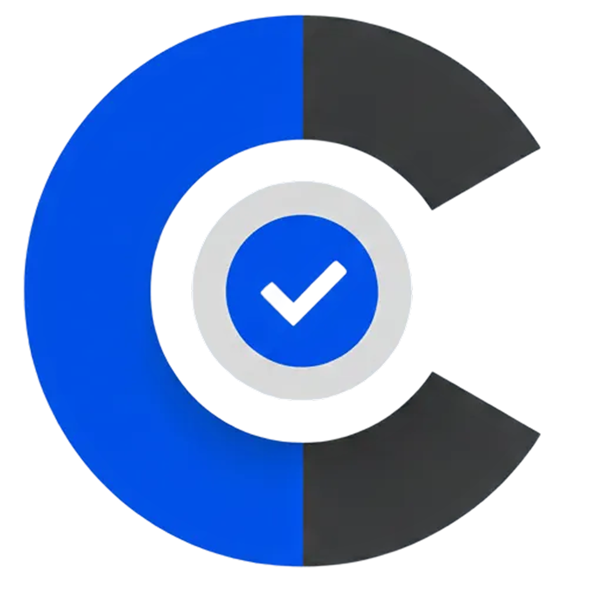

# ContrastMate

<div align="center">
  
  <h3>Professional WCAG Contrast Checker for Figma</h3>
  <p>Ensure your designs meet WCAG 2.1 accessibility standards with real-time contrast analysis</p>
</div>

<p align="center">
  
  
  
  
  
</p>

---

## ✨ Features

### 🔍 Comprehensive Scanning Engine
- **Recursive layer scanning** – Analyzes all text layers within your selection or the entire page
- **Cross-page support** – Automatically switches pages to focus on layers
- **Library font support** – Accurately identifies fonts from linked libraries
- **Timeout protection** – 30-second maximum to prevent hangs on large files
- **Real-time progress** – Live counter shows scanned layer count

### 📐 Reliable Contrast Calculation
- **WCAG 2.1 compliant** – Implements the official W3C contrast ratio algorithm
- **Smart background detection** – Calculates contrast against parent frames and sibling layers
- **Alpha channel support** – Proper alpha compositing for semi-transparent colors
- **Large text detection** – Automatic threshold calculation (18pt+ or 14pt+ bold)
- **Precise ratios** – Displays exact contrast ratios (e.g., 4.52:1)

### 🎨 Modern, Accessible UI
- **Clean dashboard** – Professional interface with status indicators
- **Powerful filtering** – Filter by Errors, Warnings, or Passed layers
- **Smart search** – Find layers by name, text content, font, or parent
- **One-click navigation** – Click any layer to focus it in Figma canvas
- **Real-time updates** – See progress as large scans process

### ♿ Full Keyboard Accessibility
- **Arrow key navigation** – Navigate filters with keyboard
- **Enter/Space activation** – Activate buttons and cards
- **Tab order** – Logical focus flow through all controls
- **ARIA labels** – Screen reader friendly
- **WCAG 2.1 AA compliant** – The accessibility tool is itself accessible!

### 🛡️ Production-Ready Reliability
- **Robust error handling** – All async operations wrapped in try-catch
- **Input validation** – Prevents malformed requests
- **Specific error messages** – Know exactly what went wrong
- **Missing font detection** – Warning icons for uninstalled fonts
- **41 unit tests** – Comprehensive test coverage
- **Zero vulnerabilities** – All dependencies up-to-date

## 🚀 Getting Started

### Prerequisites

- [Node.js](https://nodejs.org) v22 or later
- [Figma Desktop App](https://figma.com/downloads/)

### Installation

1. **Clone or download this repository**

2. **Install dependencies**
   ```bash
   npm install
   ```

3. **Build the plugin**
   ```bash
   npm run build
   ```
   
   For development with hot reload:
   ```bash
   npm run watch
   ```

4. **Import into Figma**
   - Open the Figma desktop app
   - Go to **Plugins** → **Development** → **Import plugin from manifest...**
   - Select the generated `manifest.json` file

### Usage

1. **Select layers** in your Figma document (or leave empty to scan the entire page)
2. **Run the plugin** from the Plugins menu
3. **Review the results** – errors appear at the top with red indicators
4. **Click any layer** to navigate directly to it in your design
5. **Use filters** to focus on specific issue types
6. **Re-scan** after making changes to refresh the analysis

## 📊 WCAG Compliance Levels

| Level | Normal Text | Large Text* |
|-------|-------------|-------------|
| **AAA** | ≥ 7.0:1 | ≥ 4.5:1 |
| **AA** | ≥ 4.5:1 | ≥ 3.0:1 |
| **FAIL** | < 4.5:1 | < 3.0:1 |

*Large text is defined as 18pt (24px) or larger, or 14pt (18.67px) bold or larger.

## 🏗️ Project Structure

```
ContrastMate/
├── src/
│   ├── main.ts          # Plugin logic (Figma main thread)
│   ├── ui.tsx           # Preact UI component
│   ├── scanner.ts       # Scanning engine with timeout protection
│   ├── contrast.ts      # WCAG contrast calculations
│   ├── contrast.test.ts # Unit tests (41 tests)
│   ├── components.tsx   # Reusable UI components
│   ├── icons.tsx        # SVG icon components + Logo
│   ├── types.ts         # TypeScript type definitions
│   ├── styles.css       # Tailwind CSS + custom styles
│   ├── logo.svg         # ContrastMate logo (embedded)
│   └── logo-data.ts     # Logo as base64 data URI (auto-generated)
├── scripts/
│   └── update-manifest-icon.js  # Build utility (not used)
├── build/               # Generated output
│   ├── main.js          # Compiled plugin (11KB)
│   └── ui.js            # Compiled UI (211KB)
├── logo.png             # Plugin icon for Figma Community (2044x2044px)
├── package.json         # Dependencies & plugin config
├── manifest.json        # Generated Figma plugin manifest
├── tsconfig.json        # TypeScript configuration
├── vitest.config.ts     # Test configuration
├── tailwind.config.js   # Tailwind CSS configuration
├── postcss.config.js    # PostCSS configuration
├── PUBLISHING_GUIDE.md  # How to publish to Figma Community
└── README.md            # This file
```

## 🧪 Testing

ContrastMate includes comprehensive unit tests:

```bash
# Run tests once
npm test

# Run tests in watch mode
npm run test:watch

# Run tests with UI
npm run test:ui

# Run tests with coverage report
npm run test:coverage
```

**Test Coverage:**
- ✅ 41 unit tests
- ✅ Contrast calculations
- ✅ WCAG level detection
- ✅ Large text thresholds
- ✅ All critical functions tested

## 🧪 How Contrast is Calculated

The plugin implements the official [WCAG 2.1 contrast ratio formula](https://www.w3.org/WAI/GL/wiki/Contrast_ratio):

1. **Normalize RGB values** (0-255 → 0-1)
2. **Linearize using sRGB gamma correction**:
   ```
   v ≤ 0.04045 → v / 12.92
   v > 0.04045 → ((v + 0.055) / 1.055)^2.4
   ```
3. **Calculate relative luminance**:
   ```
   L = 0.2126 × R + 0.7152 × G + 0.0722 × B
   ```
4. **Compute contrast ratio**:
   ```
   CR = (L_lighter + 0.05) / (L_darker + 0.05)
   ```

## 📦 Dependencies

### Runtime
- `@create-figma-plugin/ui` – Preact component library matching Figma's design
- `@create-figma-plugin/utilities` – Messaging utilities for main/UI communication
- `preact` – Lightweight React alternative

### Development
- `@create-figma-plugin/build` – esbuild-powered fast bundler
- `tailwindcss` – Utility-first CSS framework
- `typescript` – Type safety

## 👨‍💻 Author

**Susith Deshan Alwis**
Developer & Designer

- GitHub: [@SusithD](https://github.com/SusithD)
- Email: iamsusithalwis@gmail.com

## 🤝 Contributing

Contributions are welcome! Please:

1. Fork the repository
2. Create a feature branch (`git checkout -b feature/amazing-feature`)
3. Make your changes
4. Add tests if applicable
5. Ensure all tests pass (`npm test`)
6. Commit your changes (`git commit -m 'Add amazing feature'`)
7. Push to the branch (`git push origin feature/amazing-feature`)
8. Open a Pull Request

### Development Setup

```bash
# Install dependencies
npm install

# Start development mode (hot reload)
npm run watch

# Run tests
npm test

# Build for production
npm run build
```

## 📄 License

MIT License © 2026 Susith Deshan Alwis

Permission is hereby granted, free of charge, to any person obtaining a copy of this software and associated documentation files (the "Software"), to deal in the Software without restriction, including without limitation the rights to use, copy, modify, merge, publish, distribute, sublicense, and/or sell copies of the Software, and to permit persons to whom the Software is furnished to do so, subject to the following conditions:

The above copyright notice and this permission notice shall be included in all copies or substantial portions of the Software.

THE SOFTWARE IS PROVIDED "AS IS", WITHOUT WARRANTY OF ANY KIND, EXPRESS OR IMPLIED.

## 🔗 Resources

- [WCAG 2.1 Guidelines](https://www.w3.org/WAI/WCAG21/quickref/)
- [Create Figma Plugin Docs](https://yuanqing.github.io/create-figma-plugin/)
- [Figma Plugin API](https://figma.com/plugin-docs/)
- [Understanding Contrast Ratio](https://www.w3.org/WAI/GL/wiki/Contrast_ratio)

---
